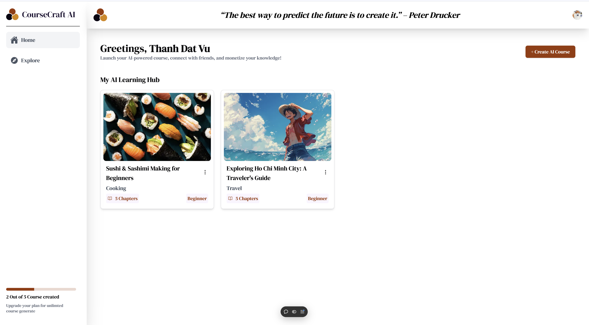

<!-- PROJECT LOGO -->
<br />
<div align="center">
  <a href="https://github.com/othneildrew/Best-README-Template">
    
  </a>
  <p align="center">
    <a href="https://aicoursegenarator.vercel.app/">View Demo</a>
    ·
    <a href="https://github.com/ThanhDatVu111/AI_CourseGenerator/issues">Report Bug</a>
    ·
    <a href="https://github.com/ThanhDatVu111/AI_CourseGenerator/pulls">Request Feature</a>
  </p>
</div>


<!-- TABLE OF CONTENTS -->
<details>
  <summary>🗂️ Table of Contents</summary>
  <ol>
    <li><a href="#about-the-project">📖 About The Project</a></li>
    <li><a href="#tech-stack">🛠️ Tech Stack</a></li>
    <li>
      <a href="#getting-started">🚀 Getting Started</a>
      <ul>
        <li><a href="#prerequisites">📋 Prerequisites</a></li>
        <li><a href="#installation">⚙️ Installation</a></li>
      </ul>
    </li>
    <li><a href="#contributing">🤝 Contributing</a></li>
    <li><a href="#license">📜 License</a></li>
    <li><a href="#contact">📧 Contact</a></li>
  </ol>
</details>

<!-- ABOUT THE PROJECT -->





The AI Course Generator is a web application designed to help users create customized courses with the assistance of AI. By using the Gemini API, users can input their own parameters to generate a course that can serve educational purposes or be shared with friends. The platform includes:

- 🔐 Clerk Authentication for secure login.
- 🌐 Google Gemini API for dynamic course creation.
- 📊 Drizzle ORM & Firebase for efficient data handling.
- ⚡ Built with Next.js & Tailwind CSS for a modern UI.

<p align="right">(<a href="#readme-top">back to top</a>)</p>


### 🛠️ Tech Stack

This project is built using modern technologies to ensure performance and scalability.

#### Frontend
* [![Next][Next.js]][Next-url]
* [![React][React.js]][React-url]
* [![Tailwind CSS][Tailwind.css]][Tailwind-url]
* [![Radix UI][Radix.ui]][Radix-url]
* [![Lucide React][Lucide.react]][Lucide-url]

#### Backend
* [![Next.js][Next.js]][Next-url]
* [![Drizzle ORM][Drizzle.orm]][Drizzle-url]
* [![Firebase][Firebase.com]][Firebase-url]
* [![Google Gemini][Gemini.ai]][Gemini-url]

#### Authentication & Database
* [![Clerk][Clerk.dev]][Clerk-url]
* [![Neon Database][Neon.tech]][Neon-url]
* [![Firebase][Firebase.com]][Firebase-url]

<!-- MARKDOWN LINKS & BADGES -->
[Next.js]: https://img.shields.io/badge/Next.js-000000?style=for-the-badge&logo=next.js&logoColor=white
[Next-url]: https://nextjs.org/
[React.js]: https://img.shields.io/badge/React-20232A?style=for-the-badge&logo=react&logoColor=61DAFB
[React-url]: https://reactjs.org/
[Tailwind.css]: https://img.shields.io/badge/Tailwind_CSS-38B2AC?style=for-the-badge&logo=tailwind-css&logoColor=white
[Tailwind-url]: https://tailwindcss.com/
[Radix.ui]: https://img.shields.io/badge/Radix_UI-161618?style=for-the-badge&logo=radix-ui&logoColor=white
[Radix-url]: https://www.radix-ui.com/
[Lucide.react]: https://img.shields.io/badge/Lucide_React-gray?style=for-the-badge
[Lucide-url]: https://lucide.dev/
[Drizzle.orm]: https://img.shields.io/badge/Drizzle_ORM-C5F74F?style=for-the-badge
[Drizzle-url]: https://orm.drizzle.team/
[Firebase.com]: https://img.shields.io/badge/Firebase-039BE5?style=for-the-badge&logo=Firebase&logoColor=white
[Firebase-url]: https://firebase.google.com/
[Gemini.ai]: https://img.shields.io/badge/Gemini_AI-8E75B2?style=for-the-badge&logo=google&logoColor=white
[Gemini-url]: https://deepmind.google/technologies/gemini/
[Clerk.dev]: https://img.shields.io/badge/Clerk-6C47FF?style=for-the-badge
[Clerk-url]: https://clerk.com/
[Neon.tech]: https://img.shields.io/badge/Neon-000000?style=for-the-badge&logo=postgresql&logoColor=white
[Neon-url]: https://neon.tech/

<p align="right">(<a href="#readme-top">back to top</a>)</p>

<!-- Badge definitions -->
[Next.js]: https://img.shields.io/badge/Next.js-000000?style=for-the-badge&logo=next.js&logoColor=white
[Next-url]: https://nextjs.org/
[React.js]: https://img.shields.io/badge/React-20232A?style=for-the-badge&logo=react&logoColor=61DAFB
[React-url]: https://reactjs.org/
[TailwindCSS.com]: https://img.shields.io/badge/TailwindCSS-38B2AC?style=for-the-badge&logo=tailwind-css&logoColor=white
[TailwindCSS-url]: https://tailwindcss.com/


<!-- GETTING STARTED -->
## 🚀 Getting Started

This is an example of how you may give instructions on setting up your project locally.
To get a local copy up and running follow these simple example steps.

### 📋 Prerequisites

Ensure you have the following installed:
- **Node.js** (latest stable version)
- **npm**
  ```sh
  npm install npm@latest -g

### Installation

_Below is an example of how you can instruct your audience on installing and setting up your app. This template doesn't rely on any external dependencies or services._

1. Get a free API Key at [https://example.com](https://example.com)
2. Clone the repo
   ```sh
   git clone https://github.com/github_username/ai-course-generator.git
   ```
3. Install NPM packages
   ```sh
   npm install
   ```
4. Enter your API in `config.js`
   ```js
    NEXT_PUBLIC_HOST_NAME=your-vercel-deployment-url
    CLERK_FRONTEND_API=your-clerk-api-key
    GEMINI_API_KEY=your-gemini-api-key

   ```
5. Change git remote url to avoid accidental pushes to base project
   ```sh
    git remote set-url origin https://github.com/github_username/your-repo-name.git
    git remote -v # confirm the changes
   ```

6. Start the development server 
    npm run dev

<p align="right">(<a href="#readme-top">back to top</a>)</p>


<!-- USAGE EXAMPLES -->
<!-- CONTRIBUTING -->
## 🤝 Contributing

Contributions are what make the open source community such an amazing place to learn, inspire, and create. Any contributions you make are **greatly appreciated**.

If you have a suggestion that would make this better, please fork the repo and create a pull request. You can also simply open an issue with the tag "enhancement".
Don't forget to give the project a star! Thanks again!

1. Fork the Project
2. Create your Feature Branch (`git checkout -b feature-name`)
3. Commit your Changes (`git commit -m 'Add some feature'`)
4. Push to the Branch (`git push origin feature-name`)
5. Open a Pull Request

<!-- LICENSE -->
## 📜 License

Distributed under the MIT License. See `LICENSE.txt` for more information.

<p align="right">(<a href="#readme-top">back to top</a>)</p>


<!-- CONTACT -->
## 📧 Contact

Thanh Dat Vu - [LinkedIn](https://www.linkedin.com/in/thanhdatvu111) - thanhdatvu.203@gmail.com

Project Link: [https://github.com/ThanhDatVu111/AI_CourseGenerator](https://github.com/ThanhDatVu111/AI_CourseGenerator)

<p align="right">(<a href="#readme-top">back to top</a>)</p>